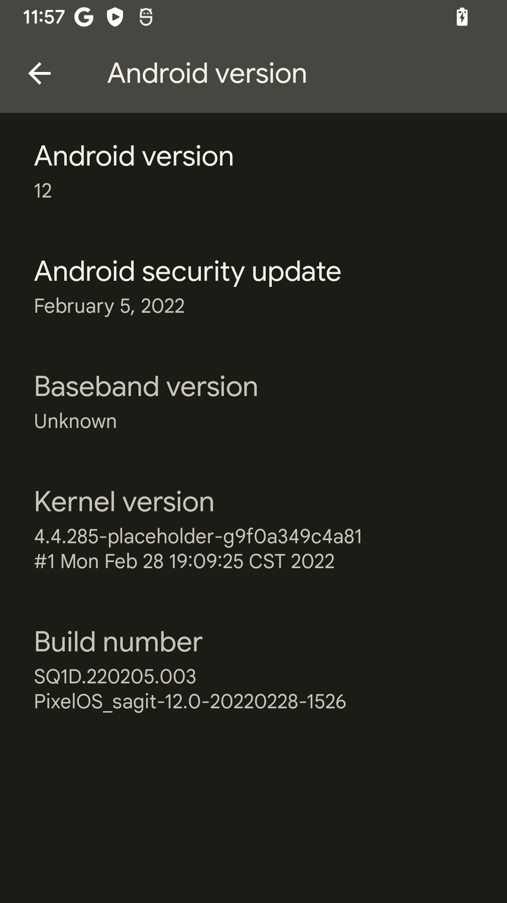

# PixelOS
PixelOS is an AOSP based ROM, with Google apps included and all Pixel goodies (launcher, wallpapers, themed icons,  google sans fonts, Monet color based system wide theming, boot animation), a fork of OG Pixel Experience with improvements on the top of it. Huge respect to Pixel Experience team for their work, thanks to them for making this ROM possible.  
In short a fully functional Pixel Experience with just the right amount of essentials.  

Your warranty is now void.  

* I am not responsible for bricked devices, dead SD cards,  
* thermonuclear war, or you getting fired because the alarm app failed. Please  
* do some research if you have any concerns about features included in this ROM  
* before flashing it! YOU are choosing to make these modifications, and if  
* you point the finger at me for messing up your device, I will laugh at you.  

# Improvements over PixelExperience  
Performance improvements from ProtonAOSP  
3-finger swipe to capture screenshots
Double tap to sleep on lockscreen and status bar  
Added Screen Recording Customizations  
Added Advanced Reboot  
Allow disabling Screenshot Sounds  
Added Bluetooth headset battery indicator  
Added in-call vibration options  
First class implementation of [URL](https://t.me/repainter_support/5432) Repainter app  
Added Adaptive playback  
Added themed icons for a lot of third party icons in stock Pixel launcher  
Added monet to Settings app icon color  
Added monet in power menu  
Exposed legacy WiFi and Cellular data QS tiles  
Added an option to disable unlock ripple animation  
Added bluetooth battery level indicator on status bar  
Added NFC tile in QS for supported devices  
Added double tap/long press power button to toggle torch  
Reduced log spam verbosity  
A lot of under the hood UI fixes and improvements  

# Device Specific Issues:
 

# Requirements

# Downloads
[Download](https://github.com/foxlesbiao/foxlesbiao.github.io/releases/tag/v3.4-test)  
[Firmware](https://xiaomifirmwareupdater.com/firmware/sagit/)  
[Magisk (optional) ](https://github.com/topjohnwu/Magisk/releases)  
[DFE (optional) (not recommended) ](https://github.com/PixelOS-Devices/builds/releases/download/2021-10-28/Disable_Dm-Verity_ForceEncrypt_20201008.zip)  
# Recovery 
PixelOS Recovery https://github.com/foxlesbiao/SHRP-device-sagit/releases

Note: GApps are included, don't flash separately.  

Notes  
• Encryption is enabled by default  
• SELinux is enforcing/permissive  
• (?) Support related to MIUI/ANX Camera  
• (?) QuicksilveR v2.5 Kernel Included  

PixelOS Recovery is recommended if you want to stay encrypted, no custom recovery supports encryption on Android12, i.e. you won't be able to decrypt your data.  

<!-- Might be different for different devices -->
Flashing Instructions  
Clean flash (coming from a different ROM):  
• Download ROM from the link above  
• Download Magisk v23.0 or newer (optionally)  
• Reboot to recovery  
• Format data (if encrypted)  
• Wipe system, vendor, cache, dalvik, data  
• Flash latest android 11 global stable firmware (link above)  
• Flash ROM zip  
• Reboot and voila!  
• To get root access, reboot to recovery after ROM setup and flash magisk.  
 
Updating to a newer build (dirty flash):  
• Flash ROM zip and magisk (optional)  
• Wipe system, vendor, cache, dalvik  
• Reboot and voila!  

Source Code  
PixelOS http://github.com/PixelOS-Pixelish  
Device Tree and Vendor Tree https://github.com/Huexxx  
Kernel Tree https://github.com/Huexxx/kernel_xiaomi_msm8998  

ROM OS Version: Android 12.0  
ROM Kernel: Linux 4.14.x  
Latest Release Date: 2022-03-01  

