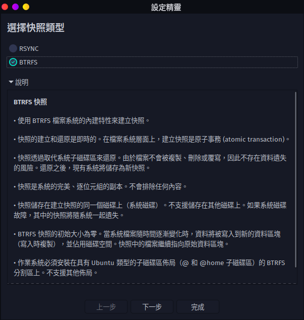
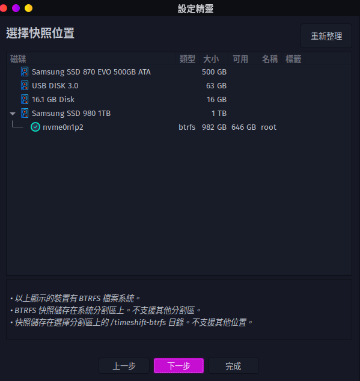
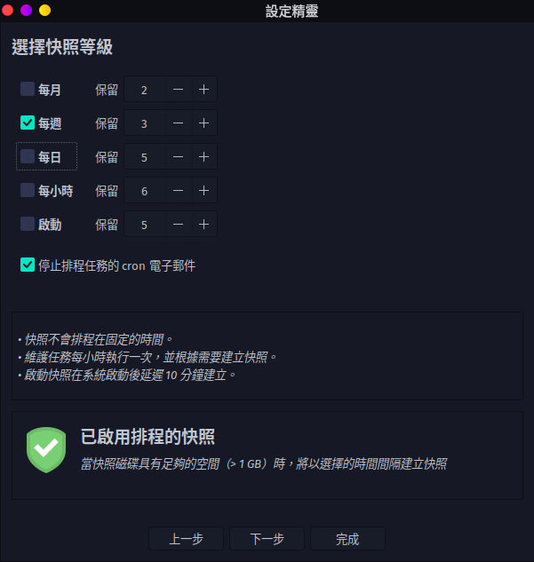

# install timeshift
> paru -Sy timeshift

## start timeshift and set timeshift
- 查看磁盤分區是否是 Btrfs 格式  
- 選擇快照類型爲 Btrfs  
-   
- 選擇快照位置爲 root  
-   
- 選擇快照計劃，看個人習慣  
-   
- 可以在備份中包含 home 分區  
-   
-
## restore backup 
1.桌面環境
* 啓動 timeshift 按照提示就可以了  
2.tty 環境    
* sudo timeshift --list   
* sudo timeshift --restore --snapshot 'XXXX-XX-XX_XX-XX-XX' --skip-grub  
3.live 環境 
* timeshift --restore --snapshot-device /dev/sdbx
