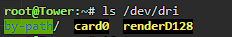
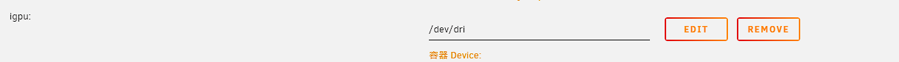
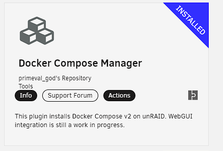
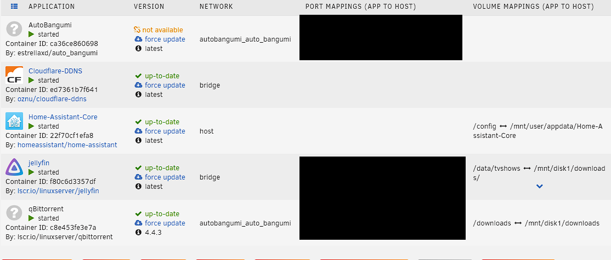

# jellyfin install

选择 lscr.io/linuxserver/jellyfin 

```shell
touch /boot/config/modprobe.d/ast.conf     AST
touch /boot/config/modprobe.d/i915.conf    Intel
touch /boot/config/modprobe.d/amdgpu.conf  AMD APU
touch /boot/config/modprobe.d/radeon.conf  AMD RADEON
modprobe i915 Intel
modprobe amdgpu AMD
reboot
ls /dev/dri
```
  
  

安装即可  

## auto_bangumi install
install docker-compose  
  

upload docker-compose.yml  
> *[office yml](https://github.com/EstrellaXD/Auto_Bangumi/tree/main/docs/docker-compose)*  

compose up

  
