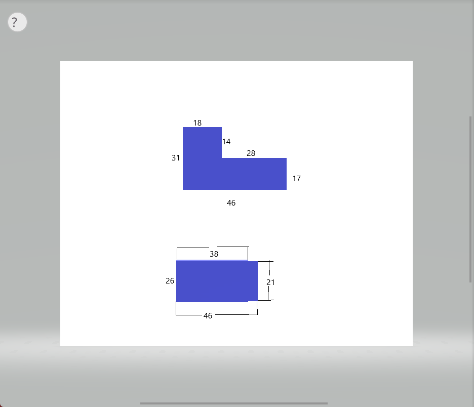

# 车架
Cygnus 4 的原车架不适用于电动化后的 Cygnus 4，需要定制车架或者改造原车架。
我选择的是定制车架，铬钼钢定制，电池仓的形状是倒 L 形

# 避震 輪轂
1.MSP UF-2B 電控式 前避震  
2.MSP DR-1 電控式 後避震  
3.75KG 不雙載  
4.MOS XR-14 前後一組  

# 制動系統
1. Brembo M50+Brembo 17RCS+FAR 赤鬼圓形碟盤 SS-N 雙碟+FAR 全金屬燒結碟煞皮/來令片/煞車皮 Brembo M50 適用  
2. Brembo CNC P2 34/硬陽大螃蟹+brembo PS9+FAR 赤鬼圓形碟盤 SS-N 單碟+FAR 全金屬燒結碟煞皮/來令片/煞車皮 Brembo CNC P2 適用  

# 外觀
1.KOSO 引擎導風胸蓋  
2.KOSO 導風傳動外蓋  
3.KOSO 導風空濾外蓋  
4.AJ部品勁戰四代個人定製大燈  
5.AJ部品勁戰四代RK5尾燈 

可能还需要一些修改，但我忘记了还需要什么要添加的改装，如果你记得请在GitHub仓库，提 issues。