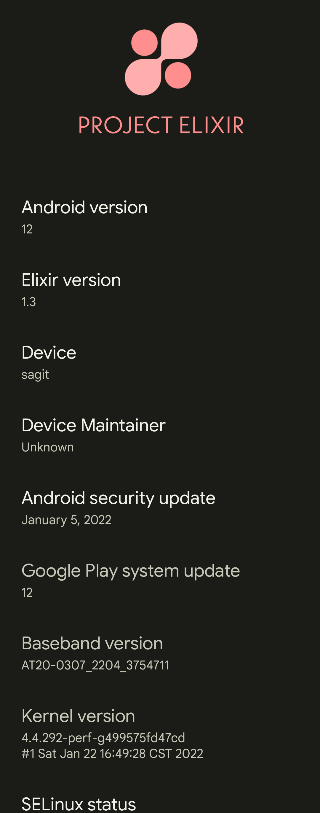

> 更新状态: 维护中  
> update status: maintain  
> 构建: Unofficial  
> Construct: Unofficial  

# Project Elixir
Project Elixir is another aftermarket AOSP ROM which basically offers minimal UI enhancement & close to Stock Android ROM with great performance, security and stability. Most of the OEMs' these days will provide slow and untimely updates, but we don't do that here. We closely follow Google to bring the latest updates to our users, and even prolong support for devices that have been declared obsolete by OEMs. Our ROMs' source code is open-source, secure, stable, and outstanding. Your experience while using Project Elixir will be butter smooth without compromising the quality of the Android experience. In short, it's perfectly balanced between Great Performance, Security, stability, minimal UI & awesome features including pixel goodies So do not hesitate anymore, join us now and start enjoying the beauty of stock Android. Download and enjoy Project Elixir on your respective devices!

# Download

Please keep in mind that these are Gapps Builds and there is no vanilla build of this rom available. 
> *[Download](https://github.com/foxlesbiao/foxlesbiao.github.io/releases/tag/v1.3-1)*

# What works?

Wifi | RIL | Mobile data | GPS | Camera
Flashlight | Camcorder | Bluetooth | Fingerprint reader | Lights | Sound | vibration
Almost everything

# What doesn't work? or Any Bug ?

You tell me

# Sources and Documentation

> *[ROM Source Code](https://github.com/Project-Elixir)*   
> *[sagit](https://github.com/AOSP-12/device_xiaomi_sagit)*   
> *[msm8998-common](https://github.com/AOSP-12/device_xiaomi_msm8998-common)*   
> *[vendor xiaomi](https://github.com/AOSP-12/vendor_xiaomi)*   
> *[kernerl](https://github.com/AOSP-12/kernel_xiaomi_msm8998)*   

# update log
 ## 2022/1/22
   1.first build

