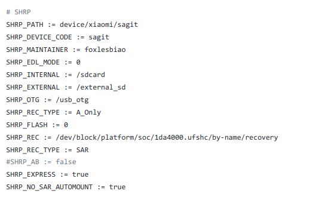

## Existing device tree compiled

这里适合已经有 device tree github 仓库的

### 1:create folder,Copy TWRP/OFRP/SHRP repository
mkdir TWRP/OFRP/SHRP && cd TWRP/OFRP/SHRP  
TeamWin Recovery Project: https://github.com/minimal-manifest-twrp/platform_manifest_twrp_omni.git  
OrangeFox Recovery Project: https://gitlab.com/OrangeFox/Manifest.git  
SKYHAWK Recovery Project: https://github.com/SHRP/platform_manifest_twrp_omni.git  

#### 1.1: sync
TWRP：repo init -u git://github.com/minimal-manifest-twrp/platform_manifest_twrp_omni.git -b twrp-9.0  
OFRP：repo init -u https://gitlab.com/OrangeFox/Manifest.git -b fox_9.0  
SHRP：repo init -u git://github.com/SHRP/manifest.git -b v3_11.0/v3_10.0/v3_9.0  
SHRP 按照分支拉取，更改后面的 v3_11.0 就可以. *[官方参考](https://shrp.github.io/#/guide)*   
TWRP/OFRP/SHRP：repo sync or repo sync -c -j$(nproc --all) --force-sync --no-clone-bundle --no-tags

### 2: copy device tree repository
1: cd source-dir  
2: git clone git@github.com:foxlesbiao/SHRP-device-sagit.git device/sagit  

#### 2.1: builder TWRP/OFRP/SHRP
1: cd source-dir  
2: . build/envsetup.sh or source build/envsetup.sh  
3: make clean && lunch omni_<device>-userdebug && mka recoveryimage  

#### 2.2: SHRP dtGuide
SHRP 需要编写 BoardConfig.mk  
可以参考我的 *[文件](https://github.com/foxlesbiao/SHRP-device-sagit/blob/fox_9.0/BoardConfig.mk)* #SHRP 的部分  
  

#### 2.3: OFRP vendorsetup
我忘记了