# Existing device tree compiled

这里适合已经有 device tree github 仓库的  
This is suitable for existing device tree github warehouses

## 1:create folder,Copy TWRP/OFRP/SHRP repository
mkdir TWRP/OFRP/SHRP && cd TWRP/OFRP/SHRP  
TeamWin Recovery Project: https://github.com/minimal-manifest-twrp/platform_manifest_twrp_omni.git  
OrangeFox Recovery Project: https://gitlab.com/OrangeFox/Manifest.git  
SKYHAWK Recovery Project: https://github.com/SHRP/platform_manifest_twrp_omni.git  

### 1.1: sync
TWRP：repo init -u git://github.com/minimal-manifest-twrp/platform_manifest_twrp_omni.git -b twrp-9.0  
OFRP：repo init -u https://gitlab.com/OrangeFox/Manifest.git -b fox_9.0  
SHRP：repo init -u git://github.com/SHRP/manifest.git -b v3_11.0/v3_10.0/v3_9.0  
SHRP 按照分支拉取，更改后面的 v3_11.0 就可以. *[官方参考](https://shrp.github.io/#/guide)*   
TWRP/OFRP/SHRP：repo sync or repo sync -c -j$(nproc --all) --force-sync --no-clone-bundle --no-tags

## 2: copy device tree repository
-  cd source-dir  
-  git clone git@github.com:foxlesbiao/SHRP-device-sagit.git device/xiaomi/sagit  
注意这个是我的设备，这个仓库不适用你的手机

### 2.1: builder TWRP/OFRP/SHRP
-  cd source-dir  
-  . build/envsetup.sh or source build/envsetup.sh  
-  make clean && lunch omni_<device>-eng && mka recoveryimage  

### 2.2: SHRP dtGuide
SHRP 需要编写 BoardConfig.mk 才可以正常编译 SHRP  
*[官方参考](https://shrp.github.io/#/dtGuide)* 也可以参考我的 *[文件](https://github.com/foxlesbiao/SHRP-device-sagit/blob/fox_9.0/BoardConfig.mk)* #SHRP 的部分  
  

### 2.3: OFRP vendorsetup
和 SHRP 一样，OFRP 也有 var 特性  
在同步 OFRP 仓库之后， vendor/recovery/orangefox_build_vars.txt 就是 OFRP 全部 var 特性  
这个文件需要放在 vendor/omni/ 或者 device/ 文件夹里面  
vendor/omni/ 文件夹是全部设备
device 文件夹是单独建立防止多设备编译搞混  
这是我的 vendorsetup.sh 文件
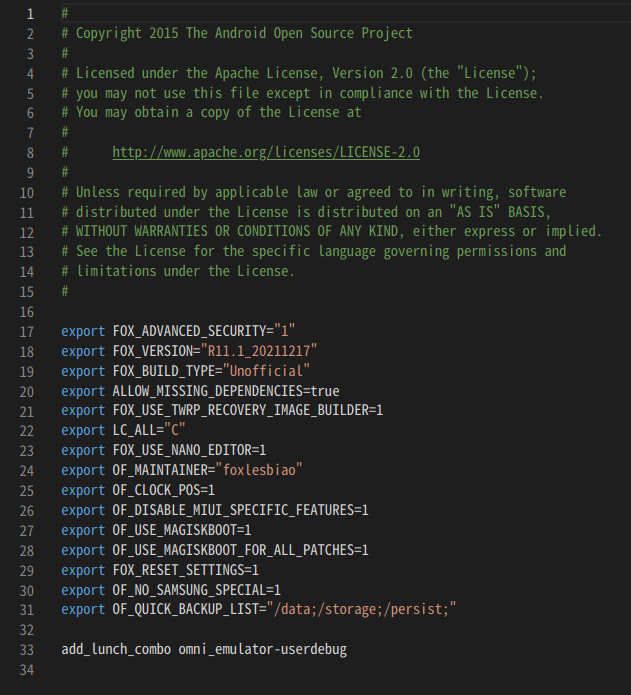  

# Write the device tree file

这里适合 github 没有 device tree 仓库的  
This is suitable for github without device tree repository  

## 1:Know your phone partition
- 独立 recovery 分区  A only 分区  
- 集成recovery 分区集成在 boot 分区  A/B 分区 V-AB 分区  
- 查看是否动态分区

### 1.1:Download the official rom and extract the img file
- 独立 recovery 分区，提取 recovery.img  
- 集成 recovery 分区，提取 boot.img  
- 解包 recovery.img 和 boot.img  文件  
### 1.2:Device tree file structure
*[可以查看我仓库里的device tree文件结构](https://github.com/foxlesbiao/SHRP-device-sagit)*
- prebuilt 文件夹是我们提取出来的预编译内核  
  image.gz 是内核本体 大概原名字是 xxxx-kernel  
  dtb.img 有一些手机会有这个文件 大概原名字是 xxxx-dtb  
  dtbo.img 如果有的话，也需要这个文件 大概原名字是 xxxx-dtbo  
- root 文件夹  
  提取在 RamDisk 目录下的全部 .rc 文件  
- mk 文件夹是手机型号各种参数  
  Android.mk 说明你的机型代号  
  AndroidProduct.mk 告知 TWRP/OFRP/SHRP 源代码说明你机型代号的名字  
  BoardConfig.mk 配置文件  
  device.mk 这个是写 A/B 分区配置文件  
  recovery.fstab 声明每个分区挂载位置，提取自 RamDisk 文件  

  ### 1.3:Write the device tree file
  注意: root/recovery 文件目录也可以是这样 recovery/root  
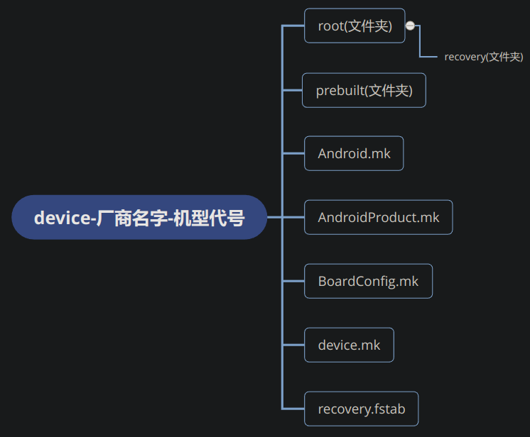
 文件命名可以参考我的[命名](https://github.com/foxlesbiao/SHRP-device-sagit)  
- 提取文件到 device tree  
   - ramdisk/etc/recovery.fstab ,把这个文件放在 device tree 根目录  
     如果没有这个文件可以在 system/etc or vendor/etc 里面的 fstab 文件，重命名为 recovery.fstab 放在 device tree 根目录
   - 把 ramdisk 文件夹下的 .rc 文件提取到 root/recovery or recovery/root
   - 把 split-img 文件夹下的 xxxx-dtbo and xxxx-dtb and xxxx-kernel  
     分别重命名为 dtbo.img and dtb.img and image.gz  
     放在 device tree 根目录的 prebuilt 目录下  
 ### 1.4:write mk file
   这个是按照我的文件编写的[查看](https://github.com/foxlesbiao/SHRP-device-sagit)
   - Android.mk 将红线部分改为你的机型代号  
     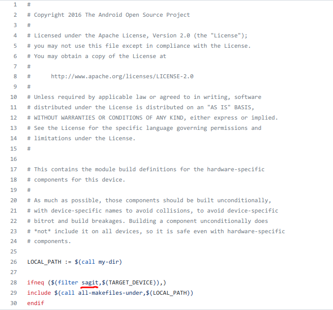
   - AndroidProducts.mk 将红线部分改为你自己所命名的文件  
     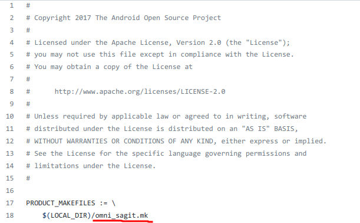 
   - BoardConfig.mk
     LOCAL_PATH := device/xiaomi/sagit > LOCAL_PATH := device/品牌英文名称/机型代号  
     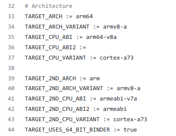 
     这个做了通用化处理  
     TARGET_OTA_ASSERT_DEVICE := sagit > TARGET_OTA_ASSERT_DEVICE := 机型代号  
     在 split-img 文件夹下找到 xxxx-cmdline 文件，打开并复制里面的话  
     BOARD_KERNEL_CMDLINE := console=ttyMSM0,115200,n8 androidboot.console=ttyMSM0 earlycon=msm_serial_dm,0xc1b0000 > BOARD_KERNEL_CMDLINE := 你复制的  
     声明预编译内核位置 dtb 和 dtbo  
     - TARGET_PREBUILT_DTB := $(LOCAL_PATH)/prebuilt/dtb.img  
     - TARGET_PREBUILT_DTBOIMAGE := $(LOCAL_PATH)/prebuilt/dtbo.img  
     - BOARD_INCLUDE_RECOVERY_DTBO := true  
     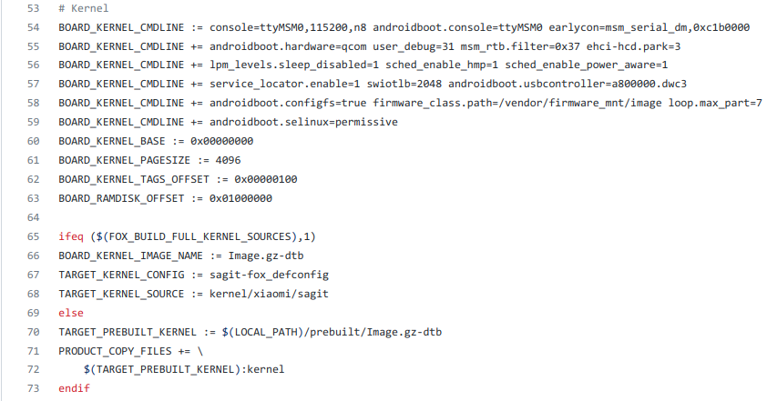  
     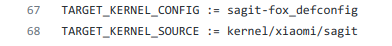 
     TARGET_KERNEL_CONFIG := sagit-fox_defconfig > TARGET_KERNEL_CONFIG := 机型代号_defconfig  
     TARGET_KERNEL_SOURCE := kernel/xiaomi/sagit > TARGET_KERNEL_SOURCE := kernel/品牌英文名称/机型代号  
     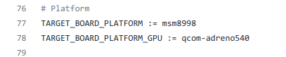
     TARGET_BOARD_PLATFORM := msm8998 > TARGET_BOARD_PLATFORM := 你的soc型号 
     动态分区需要了解 super 分区大小，了解 spuer 分区包含那些分区  
     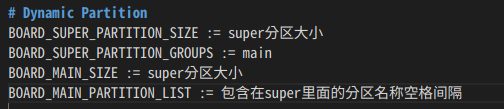  
    如果不是动态分区请删除 #System as root 和 # AVB 还有 # fstab 代码段  
    没有 AVB 验证 可以删除 # AVB 代码段  
如果有独立 recovery 分区，删除这些  
如果不是请保留  
      - BOARD_USES_RECOVERY_AS_BOOT := true  
      - TARGET_NO_RECOVERY := true  
     这个是 # Bootloader
     - TARGET_BOOTLOADER_BOARD_NAME := msm8998 > TARGET_BOOTLOADER_BOARD_NAME := 机型代号  
     - TARGET_NO_BOOTLOADER := true > TARGET_NO_BOOTLOADER := 有 fastboot 就 true，没有就 false  
     - TARGET_USES_UEFI := true V-AB 分区需要，如果不是就删除  
    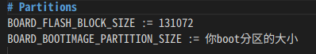  
device.mk 文件，这个文件只用于 V-AB 分区和动态分区，还有 A/B 分区的手机  
请在有 V-AB 分区的手机，device tree 仓库搜索复制到你的文件  
只需要更改这一代码段就可以了
LOCAL_PATH := device/xxxx/xxxx > LOCAL_PATH := device/品牌英文名称/机型代号  
动态分区和 A/B 分区，我不知道怎么改，[有参考的可以在这里提交给我，我来更改](https://github.com/foxlesbiao/foxlesbiao.github.io/issues)。  
omni_机型代号.mk 文件或者是 twrp_机型代号.mk
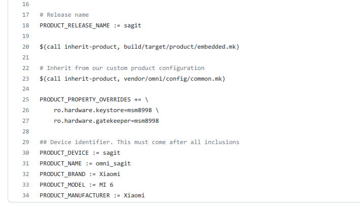 
PRODUCT_RELEASE_NAME := 机型代号  
PRODUCT_DEVICE := 机型代号  
PRODUCT_NAME := omni_机型代号 或者 twrp_机型代号  
PRODUCT_BRAND := 厂家英文  
PRODUCT_MODEL := 手机英文  
PRODUCT_MANUFACTURER := 厂家英文  

完......应该
